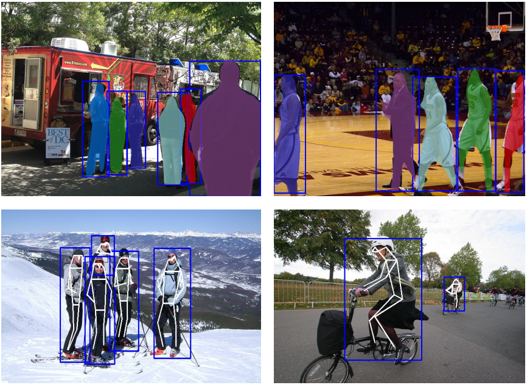
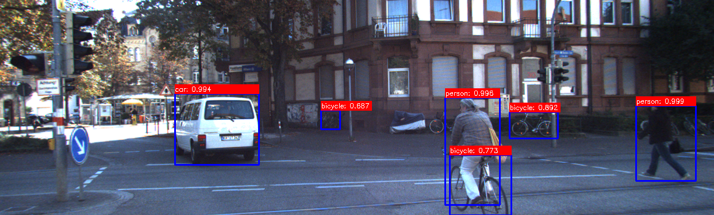

# YOLO Caffe version with MaskRCNN

**Statement:** This repo was done before *YOLACT: Real-time Instance Segmentation, ICCV 2019*. And this project was actually completed at the begining of 2018.

### Caffe-MaskYolo

#### What I add in this version of caffe?
- [x] Demos for object detection, mask segmentation and keypoints recognition
- [x] YOLO v2 (RegionLossLayer) and v3 (YoloLossLayer) are supported
- [x] Instance Mask segmentation with Yolo
- [x] Keypoints Recognition with yolo
- [x] training data preparation and training



#### preparation
```
# clone
git clone https://github.com/leon-liangwu/MaskYolo_Caffe.git --recursive

# install requirements
cd ROOT_MaskYolo
pip install -r requirements.txt

# compile box_utils
cd lib/box_utils
python setup.py build_ext --inplace

# compile caffe
cd caffe-maskyolo
cp Makefile.config.example Makefile.config
make -j
make pycaffe
```

#### download pretrained models
Click [DropBox](https://www.dropbox.com/sh/lal0vqga5nprcoq/AABqcH8h4pjm3Hm4SuKnNfMea?dl=0 "pretrained models") or [WeiYun](https://share.weiyun.com/5RhZR3S) to download pretrained models
```
cd ROOT_MaskYolo
tar zxvf /your/downlaod/model/path/pretrained_models.tgz ./models_maskyolo/
```


### Object Detection with YOLO
support to use yolo v2 or v3 to detect objects in images

#### objection demo
```
cd tools
python yolo_inference.py [--img_path=xxx.jpg] [--model=xxx.prototxt] [--weights=xxx.caffemodel]
# Net forward time consumed: 3.96ms
```
The demo result is shown below.



#### train for object detection 
```
cd ROOT_MaskYolo

# prepare voc labels, set the categories you want to detect in scripts/voc_label.py
python scripts/voc_label.py --voc_dir=/path/to/voc_dir/

# generate lmdb for detection
sh ./scripts/convert_detection.sh  /path/to/train.txt /path/to/lmdb   

# train the detection model
cd ./models/mb_v2_t4_cls5_yolo/
sh train_yolo.sh
```

### Yolo with Instance Masks 

#### detection and instance mask demo
```
cd tools
python mask_inference.py [--img_path=xxx.jpg] [--model=xxx.prototxt] [--weights=xxx.caffemodel] 
# Net forward time consumed: 8.67ms

```

#### train for mask regression
```
# compile the pythonapi of cocoapi
cd ROOT_MaskYolo/lib/cocoapi/PythonAPI
make -j

# use the following command to generate lmdb which contains mask and keypoints information
cd ROOT_MaskYolo
python scripts/createdata_mask.py --coco_dir=/path/to/coco --lmdb_dir=/path/to/lmdb

# the training for mask consists of 2 steps 
cd ./models_maskyolo/mb_body_mask

# 1. freeze the weights of detection network, only update the roi mask part
sh train_maskyolo_step1.sh

# 2. update all the network with finetuning the model of step1
sh train_maskyolo_step2.sh

```

Try your trained model with 
```
python mask_inference.py --weights=xxx.caffemodel
```

### Yolo with Instance Keypoints

#### detection and keypoints demo
```
cd tools

python kps_inference.py [--img_path=xxx.jpg] [--model=xxx.prototxt] [--weights=xxx.caffemodel] 
# Net forward time consumed: 5.58ms
```


### Reference

> You Only Look Once: Unified, Real-Time Object detection http://arxiv.org/abs/1506.02640

> YOLO9000: Better, Faster, Stronger https://arxiv.org/abs/1612.08242

> YOLOv3: An Incremental Improvement https://pjreddie.com/media/files/papers/YOLOv3.pdf

> Faster R-CNN: Towards Real-Time Object Detection with Region Proposal Networks

> Mask R-CNN 

